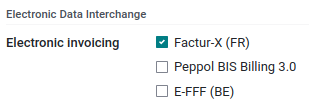

================================================================
Electronic invoicing (:abbr:`EDI (electronic data interchange)`)
================================================================

EDI, or electronic data interchange, is the inter-company communication of business documents, such
as purchase orders and invoices, in a standard format. Sending documents according to an EDI
standard ensures that the machine receiving the message can interpret the information correctly.
Various EDI file formats exist.

EDI feature enables automating the administration between companies and might also be required by
some governments for fiscal control or to facilitate the administration.

Any business that processes large volumes of documents and forms can benefit from an EDI solution to
increase automation and improve accuracy.

Since July 2022, Odoo supports, among others, the following formats.

.. list-table::
   :header-rows: 0

   * - Factur-X (CII)
     - Default format on Odoo (enabled by default)
   * - Peppol BIS Billing 3.0
     - For companies which countries are part of the `EAS list
       <https://docs.peppol.eu/poacc/billing/3.0/codelist/eas/>`_
   * - E-FFF
     - For Belgian companies
   * - NLCIUS
     - For Dutch companies
   * - XRechnung UBL
     - For German companies
   * - EHF 3.0
     - Norwegian companies have to use Peppol BIS Billing 3.0 that comply with the EHF 3.0 requirements

.. seealso::
   - :doc:`../../fiscal_localizations/overview/fiscal_localization_packages`
   - :doc:`../../fiscal_localizations/overview/localizations_list`
   - `Odoo and EDI <https://www.odoo.com/blog/odoo-news-5/odoo-and-edi-766#blog_content>`_

Configuration
=============

Go to :menuselection:`Accounting --> Configuration --> Journals --> Customer Invoices -->
Advanced Settings --> Electronic Invoicing` and enable the formats you need for this journal.

Once an electronic invoicing format is enabled, XML documents are generated, either visible or
embedded in the PDF.

.. note::
   - By default, the :guilabel:`Factur-X` option is enabled. It means that an XML file is
     automatically included in the PDF document that is sent.
   - The formats available depend on your company's localization.
   - Odoo supports the **Peppol format bis3** that can be used via existing access points.

.. important::
   If your database was created before July 2022 and you wish to use one of the new formats, you
   have to install the module `account_edi_ubl_cii` and your country-specific module.

.. example::
   If you want to use the Belgian format E-FFF in a database created prior to July 2022, you need to
   install the Belgian module (l10n_be_edi) and the account_edi_ubl_cii.

.. note::
   Once the new module is installed, UBL 2.0 and UBL 2.1 formats no longer appear in the journal.
